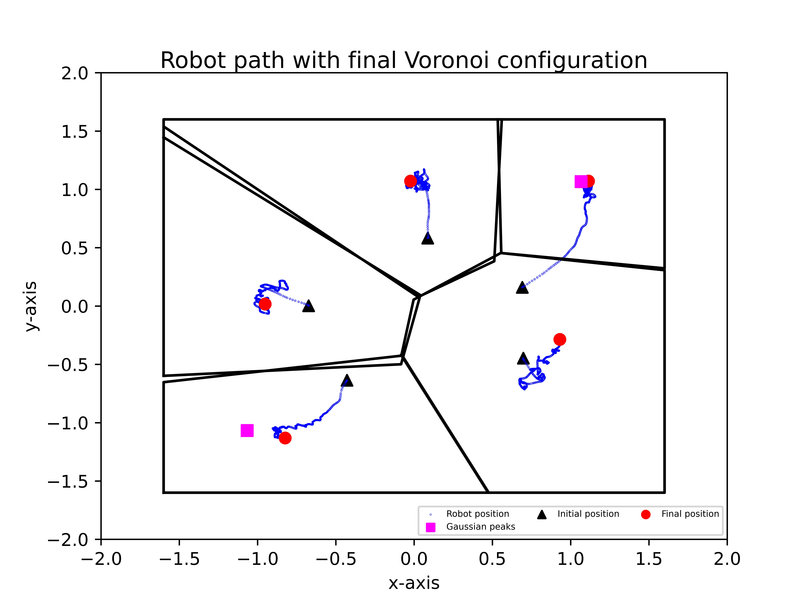
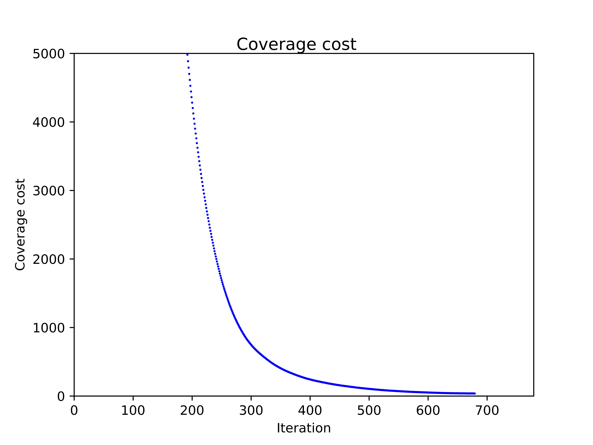
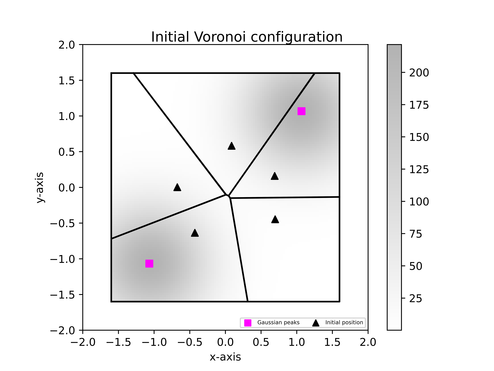
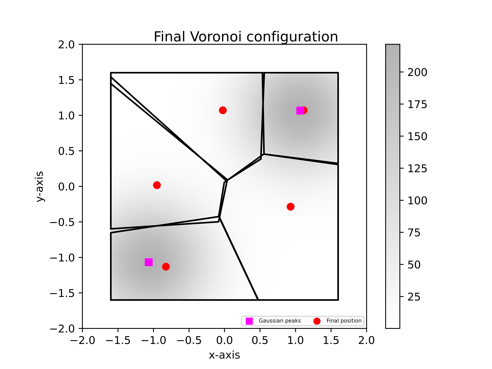

# LCSS paper's simulation plots and the real-time experiments results are shared here.

This is the public repos that contains the code and plots for the paper.

# Real-time experiment detials:
The experiment is carried out in a disturbance-free closed flight arena and an 8-optitrack Flex-13 motion capture system is used to provide the location of the drones. For experimental verification, 5 Crazyflies nano-drones are used along with the software support from USC-ACTLab (https://crazyswarm.readthedocs.io/en/latest/index.html) for implementing the low-level controller. The commands given by the ground station as the velocity commands, where distributed ROS(Noetic) nodes have been implemented for each drone. The algorithm uses many features which are not discussed explicitly like drone collision avoidance, low-level controller, etc. Here each runs the algorithm independently and only the neighbours can share the local information (positions, parameter estimates) with each other.
The experiments are done as hovering example, where height(z) is kept as constant as 0.6m. The region $\mathcal{Q}$ is chosen as (3.2m x 3.2m) square and divided into $3 \times 3$ grid. The $\mu_{\overline{m}}$ for RBF basis vector in the sensory function was chosen as the center of each grid i.e 

$$
\mu_{\overline{m}=1}^{m}=\begin{bmatrix}
-1.0066 & 0.0 & \cdots & 0.0 & 1.0665\\
1.0665 & 1.0665 & \cdots & -1.0665 & -1.0665
\end{bmatrix}
$$

with $\sigma_{\overline{p}} = 0.18$. The controller parameter has been chosen as $\zeta = 1.2;\;\gamma=1.9; \overline{\gamma}=1.9;\;\Gamma=1$. In the gradient control law $k=2.3;\phi_m=500$ and the weight of the parameter state equations is chosen as $w(\tau) = \|\dot{p}_i\|^2$. For computing the centroid, $7\times7$ grid has been used for every voronoi partition. The true parameter for the generation of the underlying distribution is chosen as

$$
a = \begin{bmatrix} \underline{\beta} & \underline{\beta} & 100 & \underline{\beta} & \cdots & \underline{\beta} & 100 & \underline{\beta} & \underline{\beta}\end{bmatrix}
$$
and with $\underline{\beta}=0.1$. The true sensory function has its maximum value at $\mu_3$= [-1.0665 -1.0665] and $\mu_7$= [1.0665 1.0665].

---

# Real-time experiments plot:

The crazyflies tracjectory along with the final Voronoi partition is given below (with true sensory function heatmap as overlay)

---

The cost function is shown below (with true sensory function heatmap as overlay) $$V = 100 * \mathcal{H} + \sum_{i=1}^N \|\tilde{a}_i\|^2$$

---

The initial and final Voronoi partition is shown below along with Gaussian peaks (with true sensory function heatmap as overlay)

  
  

---

The real-time experimental video (5 crazyflies) are shown below along with the overlay of true sensory function as heatmap

